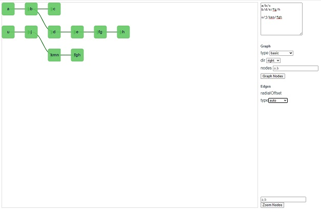

# vnodes

Vue bare components to create svg interactive graphs, diagrams or node based visual tools.

Kitchen Sink Demo (App.vue)



## Get started

Import components directly to your project or check the demo page by running `npm install && npm start`

### Example
```html
<screen ref="screen">
  <edge v-for="edge in graph.edges" :data="edge" :nodes="graph.nodes" :key="edge.id">
  </edge>

  <node v-for="node in graph.nodes" :data="node" :key="node.id">
    <!-- Arbitrary html can be placed here, defaults to node.id label -->
  </node>
</screen>
```
```js
data: {
  graph: new graph()
}
onCreate () {
  this.graph.createNode('a')
  this.graph.createNode('b')
  this.graph.createEdge('a', 'b')
  this.graph.graphNodes()
}
```

## Components

- Screen - svg wrapper with zoom, panning and others
- Node - svg element added to screen that can contain arbitrary html, defaults to a label with node id
- Edge - connect nodes
- Group - Surround nodes in a container

## TODO

- Simplify Edges api
- Edge labels
- Edges routing ( orthogonal, manhattan, metro, eg : https://resources.jointjs.com/demos/routing )
- Group component - drag Nodes, html placeholders: east,west,north,south
