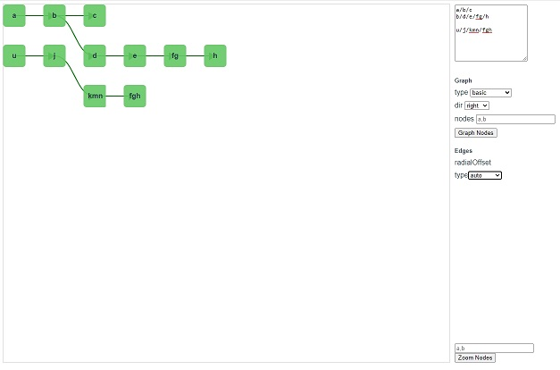

# vnodes

Vue.js bare components to create svg interactive graphs, diagrams and other visual tools.



## Get started

Import components directly to your project ``

Demos https://tiagolr.github.io/vnodes/

### Example
```html
<screen ref="screen">
  <edge v-for="edge in graph.edges" :data="edge" :nodes="graph.nodes" :key="edge.id">
  </edge>

  <node v-for="node in graph.nodes" :data="node" :key="node.id">
    <!-- Arbitrary html can be placed here, defaults to node.id label -->
  </node>
</screen>
```
```js
data: {
  graph: new graph()
}
onCreate () {
  this.graph.createNode('a')
  this.graph.createNode('b')
  this.graph.createEdge('a', 'b')
  this.graph.graphNodes()
}
```

## Components

- Screen.vue - svg wrapper with zoom, panning and other
- Node.vue - container with html placed on svg with dragging and size updating. Defaults to a label with nodeid.
- Edge.vue - connect nodes
- Group.vue - wrap nodes in a container
